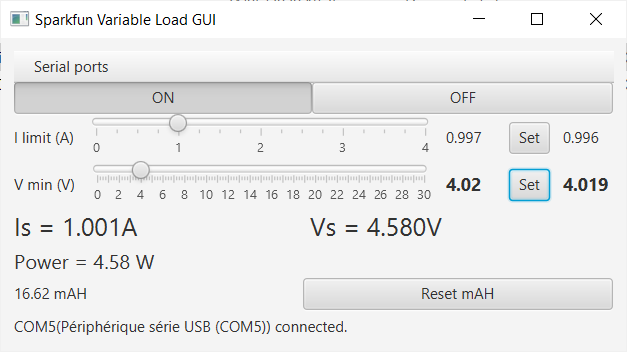

# SparkfunVariableLoadGUI
GUI for the [Sparkfun Variable Load Kit](https://www.sparkfun.com/products/14449)

# Installation

Installers available for Windows 10 and macOS on the [release page](https://github.com/casiez/SparkfunVariableLoadGUI/releases).

# Compilation

After installing gradle and JDK 14+, run `gradle run` to run the application and `gradle jpackage` to create an installer for the application.

